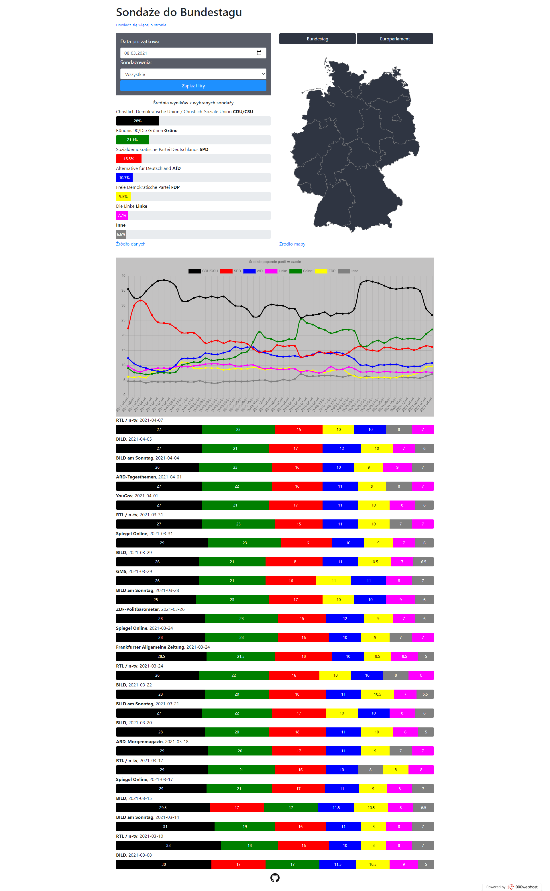

# Niemieckie sondaże
> PHP, JS, HTML5, CSS, Bootstrap i chart.js.

## Informacje ogólne
Strona internetowa, na której można zobaczyć wyniki ostatnich sondaży poparcia partii politycznych w Niemczech. Na stronie widnieją również wykresy przedstawiające panujące trendy. Działanie można przetestować na stronie: http://niemieckiesondaze.000webhostapp.com

## Szczegółowe informacje
Zasada działania oraz źródło mapy i danych opisane są na stronie: http://niemieckiesondaze.000webhostapp.com/about.php

## Grafika poglądowa

